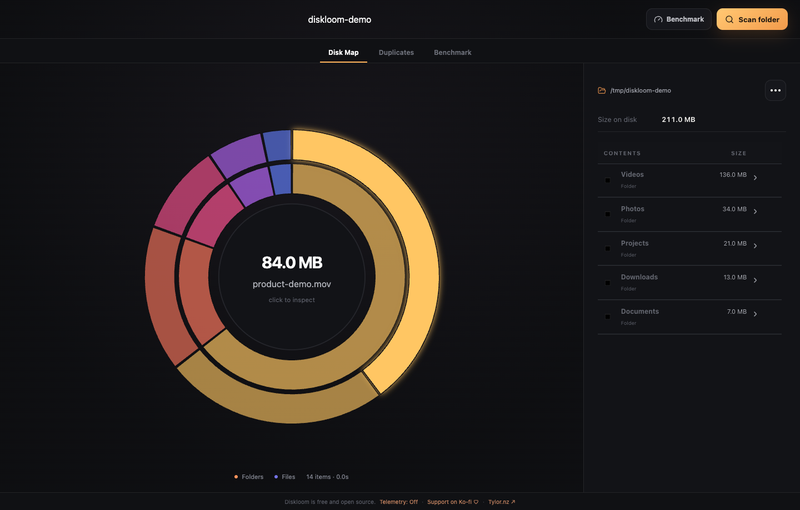
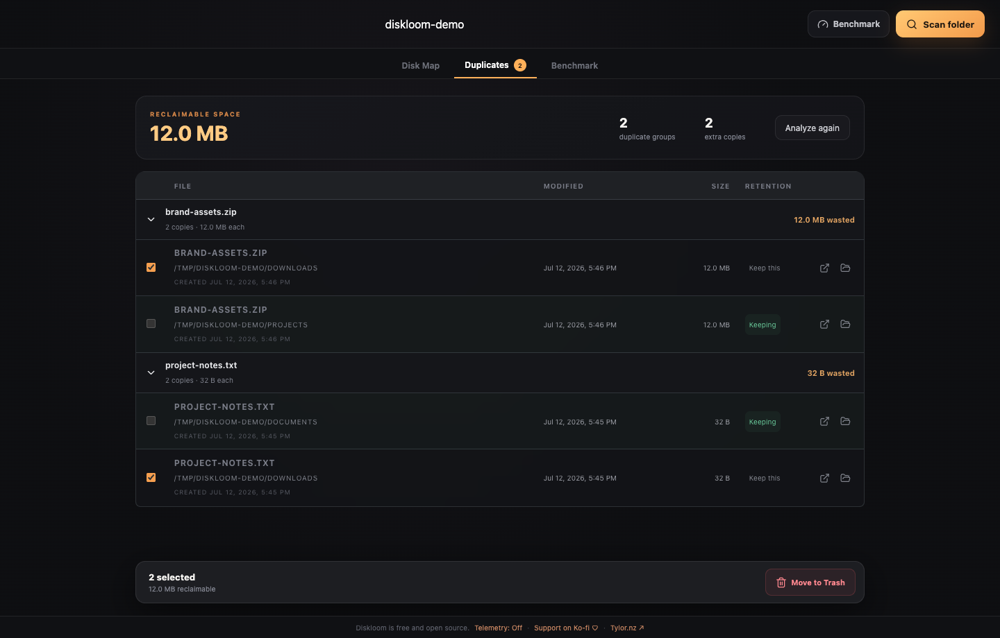

# Diskloom — Free Disk Space Analyzer for macOS, Windows, and Linux

Diskloom is a fast, private, open-source disk space analyzer and storage visualizer for macOS, Windows, and Linux. Scan drives and folders, explore disk usage, find large files, and identify duplicate files without uploading your data.

Built with Electron, TypeScript, React, and Radix UI.



## Download Diskloom

Download the latest Diskloom desktop app for your platform:

| Platform | Download |
| --- | --- |
| macOS — Apple Silicon (M1–M4) | [Download DMG](https://github.com/TylorMayfield/diskloom/releases/latest/download/Diskloom-mac-arm64.dmg) |
| macOS — Intel | [Download DMG](https://github.com/TylorMayfield/diskloom/releases/latest/download/Diskloom-mac-x64.dmg) |
| Windows — 64-bit installer | [Download EXE](https://github.com/TylorMayfield/diskloom/releases/latest/download/Diskloom-windows-x64.exe) |
| Windows — portable 64-bit | [Download ZIP](https://github.com/TylorMayfield/diskloom/releases/latest/download/Diskloom-windows-x64.zip) |
| Linux — 64-bit | [Download AppImage](https://github.com/TylorMayfield/diskloom/releases/latest/download/Diskloom-linux-x86_64.AppImage) |
| Ubuntu, Debian, and Mint — 64-bit | [Download DEB](https://github.com/TylorMayfield/diskloom/releases/latest/download/Diskloom-linux-amd64.deb) |

[View all releases and release notes](https://github.com/TylorMayfield/diskloom/releases)

## Features

- Visualize disk usage and quickly find what is taking up space.
- Scan every accessible descendant of drives or individual folders with allocated-byte totals.
- Page through the complete local scan index without dropping smaller items from exploration.
- Find large files and duplicate files.
- Build a persistent Reclaim List, review risky locations and changed items, then move approved items to Trash together.
- Keep filenames, paths, file contents, and scan results private.
- Run on macOS, Windows, and Linux.

Symlink targets are not followed, inaccessible paths and unaccounted volume space are reported, hard-linked data is counted once, and scans never upload files.

### Find duplicate files

Diskloom privately compares likely matches, shows how much space duplicate files consume, and lets you choose which copy to keep.



## Development

```bash
pnpm install
pnpm dev
```

## Build

```bash
pnpm build
```

## Support

[Support this free and open-source project on Ko-fi](https://ko-fi.com/tylormayfield).

## Privacy and legal

Diskloom processes filesystem information locally. Optional Google Analytics telemetry is disabled until you explicitly allow it and never includes paths, filenames, file contents, hashes, drive names, or benchmark results.

- [Privacy Policy and Terms of Service](https://www.tylor.nz/legal)
- Questions, privacy requests, and source inquiries: [tylorjmayfield@gmail.com](mailto:tylorjmayfield@gmail.com)

## License

Copyright © 2026 BarkOnTrack LLC. Diskloom is available under the [MIT License](LICENSE), which permits use, modification, and redistribution with the required copyright and license notice.
